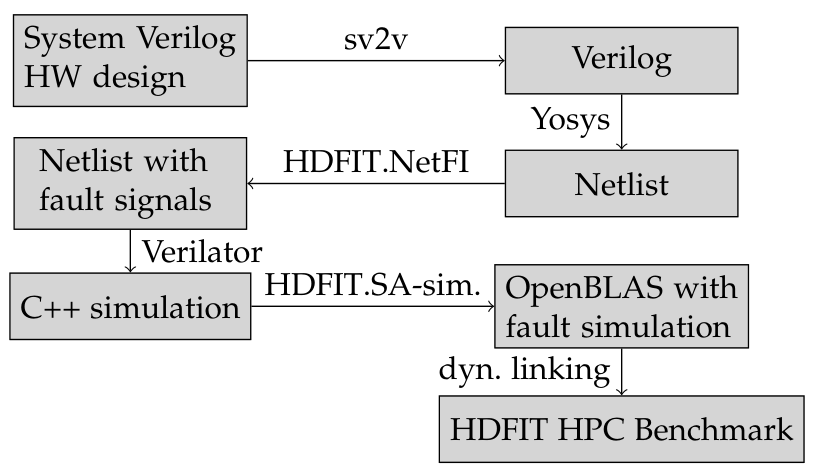

# HDFIT.NetlistFaultInjector

The HDFIT.NetlistFaultInjector modifies Verilog netlists to include fault injection signals and is part of the [HDFIT toolkit](https://github.com/IntelLabs/HDFIT). It is tested with the toolchain described below ([Example Toolchain](#exampleToolchain)), but in principle should work with Verilog netlists produced by other tools. The returned netlist with fault injection signals contains no special macros requiring the use of Verilator, so may also be simulated / synthesized to other targets for fault injection experiments.

## <a id="exampleToolchain"></a> Example Toolchain

<p align="center" width="100%">
    
</p>

The HDFIT toolkit is structured as follows: [System Verilog](https://en.wikipedia.org/wiki/SystemVerilog) HW design files => [sv2v](https://github.com/zachjs/sv2v) => [Yosys](https://github.com/YosysHQ/yosys) => NetlistFaultInjector => [Verilator](https://www.veripool.org/verilator/) => C++ netlist simulation with faults

1. [System Verilog](https://en.wikipedia.org/wiki/SystemVerilog) HW design files: The [RTL](https://en.wikipedia.org/wiki/Register-transfer_level) modelling your hardware design
2. [sv2v](https://github.com/zachjs/sv2v): In the next step we use Yosys to create a netlist. Yosys only supports [Verilog](https://en.wikipedia.org/wiki/Verilog) so we need to convert.
3. [Yosys](https://github.com/YosysHQ/yosys): Creating a Netlist using e.g. Yosys' internal gate cell library (ref. [Yosys Manual](https://github.com/YosysHQ/yosys-manual-build/releases/download/manual/manual.pdf), ch. 5 "Internal Cell Library"). The netlist returned by Yosys is written in Verilog.
4. HDFIT.NetlistFaultInjector: This tool modifies the Verilog netlist to include fault injection signals.
5. [Verilator](https://www.veripool.org/verilator/): Creates a C++ library Verilog simulation.

Unless using a rolling-release distribution such as Arch Linux, we strongy recommend building these packages yourself. The packages shipped with e.g. Ubuntu are years out of date and are missing important bug-fixes that prevent our hardware projects from simulating correctly.

## Building

```console
foo@bar HDFIT.NetlistFaultInjector:~$ make
```

## <a id="testing"></a>Testing
Requires [sv2v](https://github.com/zachjs/sv2v), [yosys](https://github.com/YosysHQ/yosys) and [verilator](https://www.veripool.org/verilator/) binaries to be in PATH (see [Example Toolchain](#exampleToolchain)), e.g.

```console
foo@bar:~$ export PATH=~/<my path to>/sv2v/bin/:$PATH
```

The tests may be run by

```console
foo@bar HDFIT.NetlistFaultInjector:~$ make
foo@bar HDFIT.NetlistFaultInjector:~$ cd test
foo@bar test:~$ export VERILATOR_TOP=<path to verilator>
foo@bar test:~$ make -j && ./test
```

which should produce "Test successful".

## Functionality
To explain the functionality, we'll use the files generated as part of the test ([Testing](#testing)). As part of the a file "fma_netlist.v" is created. This contains the modified netlist with fault signals. Additionally to the original inputs of the top module "fma", (a, b, c, d, clk - see "fma.sv"), three new inputs have been added (search for "module fma" in "fma_netlist.v"):

* ``wire [31:0] GlobalFiNumber``: NetlistFaultInjector enables fault injection for each assignment (``=``,``<=``) by modifying an original assignment. In this process, every assignment is associated with a unique "FiNumber". This way, the user may select which assignment to corrupt. For instance, ``a <= b;`` may become ``a <= b ^ ((fiEnable && (42 == fma.GlobalFiNumber)) ? fma.GlobalFiSignal[0] : 1'b0);`` - that is: This particular assignment has FiNumber = 42.
* ``wire [2:0] GlobalFiSignal``: The assignment might be more than one bit wide. Using GlobalFiSignal one can choose which bits to corrupt, by only setting those bits. The auto-generated file "fmaFiSignals.cpp" supplies the width of each assignment.
* ``wire [15:0] GlobalFiModInstNr[3]`` Each module may be instantiated multiple times nested in different other modules. The GlobalFiModInstNr[] array's length equals the design's module hierarchy depth. Each instance of a module is assigned a unique identifier. This way, by specifying a chain of module instance numbers, one may target a specific module instance down the module instance hierarchy. For the chosen instance, the local signal ``fiEnable`` from the example above will be true: Only in that particular instance will the assignment ``GlobalFiNumber`` be corrupted.

Finally, as mentioned above, a "fmaFiSigmal.cpp" file is auto-generated, containing the module / signal / instance structure of the design. With "netlistFaultInjector.cpp/hpp" a library to interface to this file is provided for choosing e.g. random fault signals - refer to "HDFIT.NetlistFaultInjector/test/main.cpp" for example usage.


